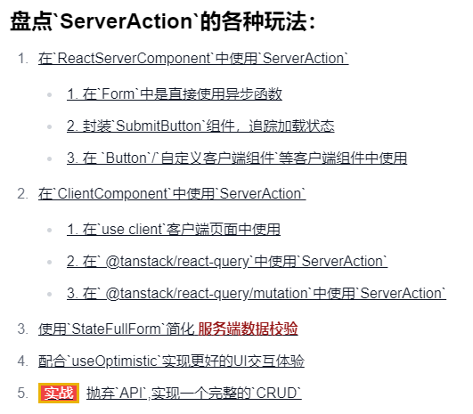
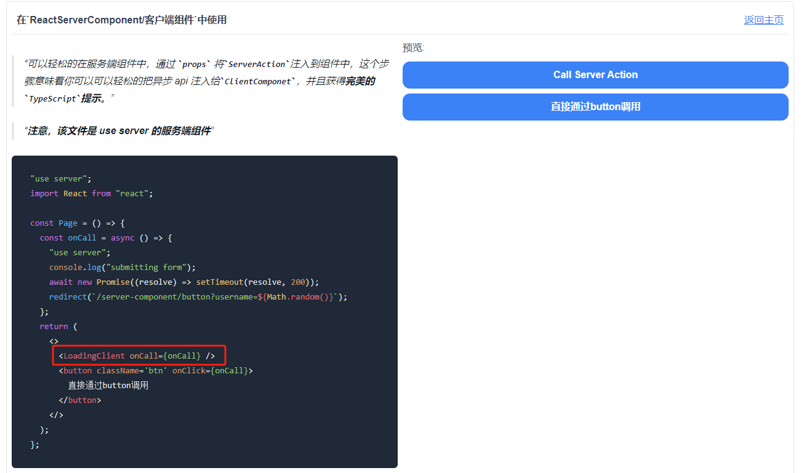

# 也许你并不需要状态管理，也不需要**ApiEndpoint** ，盘点**ServerAction** 的各种玩法

### [在线预览](https://nextjs-serveraction.ggss.club/)

> 最新的ServerAction配合服务端组件，基本完成了完善Nextjs对于数据获取修改(DataFetch/mutation)的闭合。 本文尝试从实践的角度，多方位实验**ServerAction**的玩法🌟

## 在常规的`ReactServerComponent` 中使用 `ServerAction`

###  在 `Form` 中直接使用异步函数
- 在 `Form` 组件中，可以直接调用异步的 `ServerAction` 函数来处理表单提交。

[在线预览](https://nextjs-serveraction.ggss.club/server-component/form)

我们只要在这边封装一个异步函数，就会被自动处理, 无需额外的代码，注意我们可以在异步函数中随意调用数据库代码

###  封装 `SubmitButton` 组件，追踪加载状态
- 创建一个 `SubmitButton` 组件，用于封装表单提交按钮，并追踪提交过程中的加载状态，提升用户体验。

> `useFormStatus`是一个新的`hook`，用于追踪表单提交状态，需要注意的是必须配合 **use client** 指令使用。

[在线预览](https://nextjs-serveraction.ggss.club/server-component/submit-button)

###  通过服务端组件传递到客户端组件(**props**)
- 在客户端组件中，如 `Button` 或自定义的客户端组件(案例中`LoadingClient`)中，调用 `ServerAction` 来处理服务端逻辑。

[在线预览](https://nextjs-serveraction.ggss.club/server-component/button)

## 在 `ClientComponent` 中使用 `ServerAction`

> 在客户端组件中使用`ServerAction`，需要注意的是，必须独立`action.ts`并且配合 **use server** 指令使用。

### 在 `use client` 客户端页面中使用
- 在客户端页面中，使用 `use client` 指令来调用 `ServerAction`，处理客户端与服务端的数据交互。

[在线预览](https://nextjs-serveraction.ggss.club/client-component)

### 在 `@tanstack/react-query` 中使用 `ServerAction`
- 结合 `@tanstack/react-query`，使用 `ServerAction` 来处理数据查询和更新，简化数据管理。

[在线预览](https://nextjs-serveraction.ggss.club/client-component/use-query)

### 在 `@tanstack/react-query/mutation` 中使用 `ServerAction`
- 在 `@tanstack/react-query` 的 `mutation` 中使用 `ServerAction`，实现数据的增删改操作。

[在线预览](https://nextjs-serveraction.ggss.club/client-component/use-mutation)

## 使用 `useStateAction` 简化服务端数据校验
- 使用 `useStateAction` 组件来简化服务端数据校验逻辑，可以简化异常状态管理，提升代码可读性。

[在线预览](https://nextjs-serveraction.ggss.club/server-component/statefull-form)

## 配合 `useOptimistic` 实现更好的 UI 交互体验
- 结合 `useOptimistic` 钩子，实现乐观更新，提升用户交互体验

[在线预览](https://nextjs-serveraction.ggss.club/client-component/optimistic-update)

## 实践：能否抛弃 `API`，实现一个完整的 `CRUD`
- 通过 `ServerAction`，完全抛弃传统的 `API` 调用，实现一个完整的 `CRUD` 应用。

### 🎉Feature 🎉
1. 使用`ServerAction`完成增删改查
2. 使用`并行路由/拦截路由`完成`Modal/url 自动拦截访问`的操作

[在线预览](https://nextjs-serveraction.ggss.club/server-component/crud)

